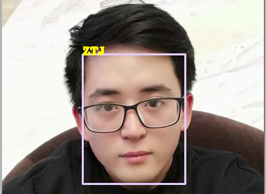
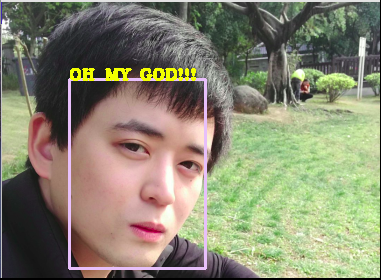

# 1简介

面部识别系统现在在大多数领域中起到举足轻重的作用，尤其是用网络安全，银行，海关，物业管理，智能门禁系统，驾照核验，笔记本人脸登录。人脸识别技术现应用于诸多领域，日后的应用前景十分广阔。

# 2需求功能与可选技术

（1）获取预训练数据集的功能
coumputer-Vision(计算机视觉)是人工智能的重要分支，它是一门利用计算机模拟生物视觉的学科。人们借助计算机来实现对目标事物的Recoginition（识别）、Classification（分类）、Track(跟踪)等。

Intel发起并参与开发的OpenCV，是一个开源且可以运行在Linux,Android,Macintosh等多个平台的计算机视觉库。此外，OpenCV提供了包括Python在内的多种语言接口。

本程序将通过笔记本摄像头获取人脸数据；当然，也可以使用你的专属素颜自拍。

（2）检测人脸的功能

现实生活中的人脸检测已被用于多个行业（诸如社会安保、娱乐场所）。对获取的预训练数据集进行照片分类、边界框回归、关键点定位。

相关的算法例如OpenCV本身所提供的Haar-Cascade-Classifier（Haar级联分类器）；还有基于神经网络（Neural Network）的MTCNN算法等等。

（3）提取特征的功能

相关功能的实现方法包括Google的基于深度卷积神经网络的Facenet模型、Facebook的DeepFace。

（4）匹配特征的功能

此部分的实现方法包括“K-最近邻匹配算法”（即KNN）、“Flann算法”等。

# 3ShowTime

